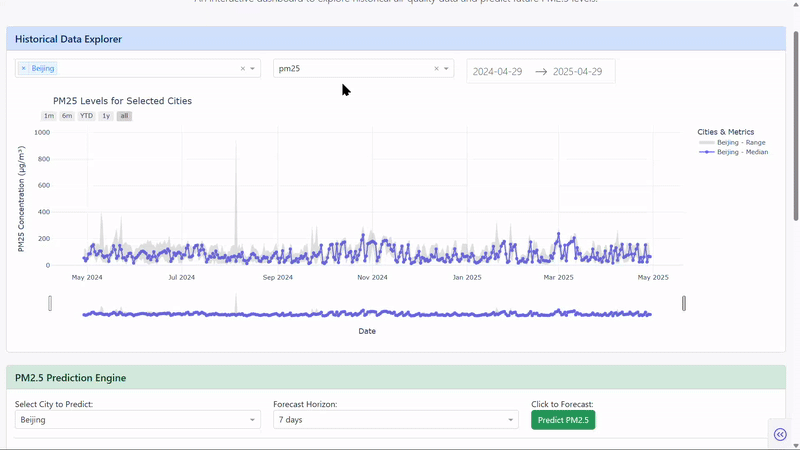

# Dash Web Application

This folder contains the **interactive web application** for air quality forecasting and visualization, built with [Plotly Dash](https://dash.plotly.com/). The app is the main user interface for the project, allowing users to explore historical weather and air quality data, visualize trends, and make real-time PM2.5 predictions using the trained LSTM model.

## App Preview

  

## Features

- **Interactive Data Visualization:**  
  Explore time series and geospatial maps of air quality indicators (PM2.5, PM10, CO, SO₂, NO₂, O₃) across China from 2014 to 2025.

  

- **Real-time PM2.5 Prediction:**  
  Input weather and pollutant values to get instant PM2.5 forecasts powered by the LSTM model.

  

- **Geospatial Mapping:**  
  View pollutant distributions on a map using Folium, embedded directly in the dashboard.

  

- **User-friendly Dashboard:**  
  Responsive layout with cards, dropdowns, sliders, and plots for easy navigation and analysis.


## Folder Structure

```bash
app/
├── app.py               # Main Dash app script
├── dataset/             # Saved dataframe from analysis 
├── model_files/         # Saved model and its support files
├── assets/              # Custom CSS and static files
├── requirements.txt     # Python dependencies
```


## How to Run the App

1. **Create & activate the virtual environment:**
   Here's a quick guide for creating and activating a Python virtual environment (`.venv`) on both Windows and Linux:

    **Create Virtual Environment**
    ```bash
    python -m venv .venv
    ```
    *(Use `python3` instead of `python` on Linux if needed.)*

    **Activate Virtual Environment**
    **Windows (CMD/PowerShell)**
    ```cmd
    :: CMD
    .\.venv\Scripts\activate

    # PowerShell
    .\.venv\Scripts\Activate.ps1
    ```

    **Linux/macOS (Bash/Zsh)**
    ```bash
    source .venv/bin/activate
    ```

2. **Install dependencies:**
   ```sh
   pip install -r requirements.txt
   ```
   **Users in china:**
   ```sh
   pip install -r requirements.txt -i https://mirrors.tuna.tsinghua.edu.cn/pypi/web/simple
   ```

3. **Prepare Required Files:**
   - Ensure the trained LSTM model (`.h5` or `.keras`) and scaler (`.pkl`) are available in the `model_files/` folder of app.
   - Place the generated `china_air_quality_map.html` (from the analysis part) in the `assets/` folder for map display.

4. **Start the Dash App:**
   ```sh
   python app.py
   ```
   - The app will be available at [http://127.0.0.1:8050/](http://127.0.0.1:8050/) by default.


## Usage Guide

- **Navigation:**  
  Use the sidebar or top navigation (if present) to switch between different views (e.g., time series, map, prediction).

- **Visualization:**  
  Select date ranges, cities, or pollutants to update the plots and maps dynamically.

- **Prediction:**  
  Enter weather and pollutant values in the input form and click "Predict" to see the LSTM model's PM2.5 forecast.

- **Map Interaction:**  
  The embedded Folium map allows for zooming and panning to explore spatial patterns.


## Customization

- **Styling:**  
  Modify or add CSS files in the `assets/` folder to change the app's appearance.

- **Model Updates:**  
  Replace the model and scaler files with retrained versions to improve prediction accuracy.


## Troubleshooting

- **Map Not Displaying:**  
  Ensure `china_air_quality_map.html` exists and is up-to-date. Regenerate it from the analysis notebook if needed.

- **Model Loading Errors:**  
  Check that the model and scaler files are present and the parameters are same as used during training.

- **Dependency Issues:**  
  Double-check that all required packages are installed using `requirements.txt`.


## Credits

Developed as part of the SDUST Pioneer Intelligent Computing 2025 competition by **Team NEXUS**.

For questions, refer to the main project [README](../README.MD) or open an issue.
